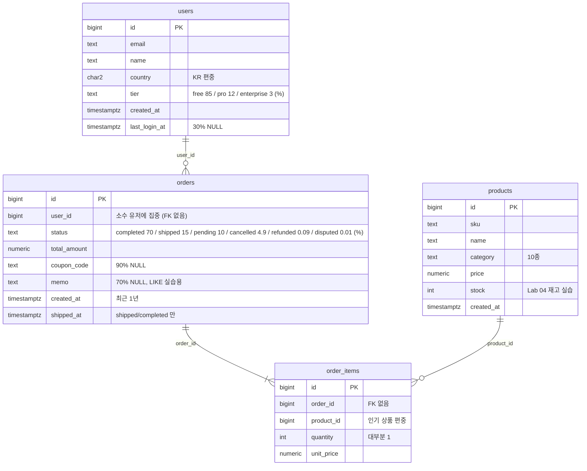

# DB_practice — PostgreSQL / pgvector / Redis 심화 실습 환경

인덱스·실행 계획, 슬로우 쿼리, 트랜잭션 격리, 락, VACUUM, pgvector, Redis 캐시를 **직접 재현하고 수치로 기록** 하기 위한 로컬 실습 저장소입니다.
문제 시나리오와 측정 도구만 있고 정답은 없습니다. 각 lab 의 `record.md` 에 "재현 → 원인 → 해결 → 수치" 를 남기는 것이 목표입니다.

| 구성 | 버전 | 비고 |
|---|---|---|
| PostgreSQL | 18 (`pgvector/pgvector:0.8.6-pg18`) | pgvector 0.8.6, pg_stat_statements, auto_explain(기본 꺼짐), pgstattuple, pg_buffercache |
| Redis | 8.10.2 | AOF 켜짐, 별도 볼륨 |
| MySQL (선택) | 8.4 LTS | `--profile mysql` 로만 기동. InnoDB 와 비교용 |
| 측정 도구 | Python 3 + psycopg 3 + redis-py | `tools/measure.py`, `tools/compare.py` |

## 처음 한 번

```bash
cp .env.example .env        # 포트가 겹치면 여기서 바꿈 (기본 5432 / 6379 / 3306)
make up                     # postgres + redis 기동, healthy 대기, 확장·PING 확인 출력
make venv                   # .venv 생성 + 의존성 설치
make seed-small             # users 10만 / orders 100만 / order_items 약 225만  (약 10초, ~330MB)
```

- `make` 만 치면 명령 목록이 나옵니다.
- large 규모(users 100만 / orders 1,000만 / items 약 2,250만, 3.5~5GB, 2~5분 추정)는 `make seed-large`. 실행 전 확인 프롬프트가 뜹니다.
- 시드 결과 확인: `make verify` (행 수, 크기, status 분포, 주문 편향, NULL 비율, 인덱스 목록)

## Lab 진행 순서

각 폴더의 `README.md` 에 문제와 측정 항목, `record.md` 에 기록 템플릿이 있습니다. 01 → 07 순서를 권장하지만 03·04 는 독립적입니다.

| Lab | 주제 | 필요한 것 |
|---|---|---|
| [01-index-explain](labs/01-index-explain/) | 인덱스 없는 느린 쿼리 7개 → 실행 계획 읽기 → 인덱스 설계 → before/after | seed, venv |
| [02-slow-query](labs/02-slow-query/) | pg_stat_statements 로 문제 쿼리 찾기, OFFSET vs keyset, N+1 재현 | seed, venv |
| [03-transaction-isolation](labs/03-transaction-isolation/) | dirty / non-repeatable / phantom / write skew / lost update 를 세션 2개로 재현 | seed, 터미널 2개 |
| [04-locks](labs/04-locks/) | 재고 차감 동시성, FOR UPDATE / SKIP LOCKED 작업 큐, 데드락 | seed, venv, 터미널 2~3개 |
| [05-ops](labs/05-ops/) | 대량 UPDATE → dead tuple → VACUUM / VACUUM FULL / autovacuum 관찰 | seed |
| [06-pgvector](labs/06-pgvector/) | 384차원 더미 임베딩, HNSW vs IVFFlat (빌드 시간·크기·recall·지연) | venv |
| [07-redis](labs/07-redis/) | PG vs Redis 조회 측정, 캐시 어사이드 + TTL, rate limit (고정/슬라이딩) | seed, venv |

Lab 을 넘어갈 때 인덱스를 초기화하려면 `make sql FILE=labs/01-index-explain/reset_indexes.sql`.

## 측정 도구 사용법

```bash
# before 저장 → (인덱스 등 변경) → after 저장 → 비교표 출력
.venv/bin/python tools/measure.py --sql labs/01-index-explain/queries/q1_range.sql --label q1_before
.venv/bin/python tools/measure.py --sql labs/01-index-explain/queries/q1_range.sql --label q1_after
.venv/bin/python tools/compare.py q1_before q1_after
```

- `measure.py` 는 쿼리를 N 회(기본 3) 실행한 벽시계 시간과 `EXPLAIN (ANALYZE, BUFFERS)` 의 실행 시간·버퍼 수치·계획 전문을 `results/YYYY-MM-DD/HHMMSS_<label>.txt` / `.json` 에 저장합니다.
- `--set work_mem=64MB --set enable_seqscan=off` 처럼 세션 설정을 바꿔 비교할 수 있고, `--rollback` 으로 UPDATE/DELETE 를 되돌리며 측정할 수 있습니다.
- `compare.py` 출력은 마크다운 표라 `record.md` 에 바로 붙일 수 있습니다.
- `results/` 는 git 에서 무시됩니다. 남기고 싶은 결과는 `record.md` 에 옮기거나 `git add -f` 하세요.

## 세션 두 개로 실습하기 (Lab 03, 04)

터미널을 두 개 열고 각각 `make psql-a`, `make psql-b`. 프롬프트가 `[A]`, `[B]` 로 표시되고 `application_name` 이 `session_A/B` 로 잡혀서 세 번째 터미널에서 `make sql FILE=labs/04-locks/locks.sql` 로 누가 누구를 막고 있는지 볼 수 있습니다.

## 스키마

PK 만 있고 FK·보조 인덱스는 없습니다(실습에서 직접 만듭니다). 자세한 분포는 `seed/00-schema.sql` 주석 참고.



Lab 06 은 별도로 `doc_chunks(id, doc_id, chunk_no, content, embedding vector(384))` 를 만듭니다.

## PostgreSQL 설정

`docker/postgres/postgresql.conf` 가 컨테이너에 마운트됩니다. 값을 바꾸면 `make restart-pg`.

- `shared_preload_libraries = 'pg_stat_statements,auto_explain'` — 둘 다 로드됨. 재시작 후에도 유지되는지 `make status` 로 확인
- `shared_buffers = 1GB` — large 시드가 캐시에 다 안 올라가도록 일부러 작게
- `work_mem = 4MB` 기본값 — 정렬이 디스크로 넘치는 상황을 보고 세션에서 올려가며 비교
- `track_io_timing = on`, `log_lock_waits = on`, `log_autovacuum_min_duration = 0`
- `random_page_cost` 는 기본값 4.0 (SSD 값 1.1 은 Lab 01 에서 직접 비교)

### auto_explain 켜기

기본은 꺼져 있습니다 (`auto_explain.log_min_duration = -1`).

```sql
SET auto_explain.log_min_duration = 200;                       -- 현재 세션, 200ms 이상
ALTER SYSTEM SET auto_explain.log_min_duration = 200;          -- 전체 (새 세션부터)
SELECT pg_reload_conf();
ALTER SYSTEM RESET auto_explain.log_min_duration; SELECT pg_reload_conf();   -- 끄기
```

로그는 `make logs` 로 봅니다. `auto_explain.log_analyze/buffers/timing` 은 이미 on 이라 실제 실행 계획이 찍힙니다.

## MySQL(InnoDB) 비교 (선택)

```bash
make up-mysql          # mysql 컨테이너 추가 기동 (기본 make up 에는 포함 안 됨)
make seed-mysql        # small 규모만 지원
make mysql             # 클라이언트
```

Lab 03 의 격리 수준 시나리오, Lab 04 의 락 시나리오를 같은 순서로 돌려 차이를 기록하는 용도입니다.

## 자주 겪는 문제

**포트 충돌** — `make up` 에서 `port is already allocated` 또는 `address already in use`
`.env` 의 `POSTGRES_PORT` / `REDIS_PORT` / `MYSQL_PORT` 를 바꾸고 다시 `make up`. 도구들은 `.env` 를 읽으므로 다른 수정은 필요 없습니다. 사용 중인 프로세스 확인: `lsof -nP -iTCP:5432 -sTCP:LISTEN`.

**볼륨 초기화 / 처음부터 다시** — `make reset` (확인 프롬프트 후 컨테이너와 볼륨 삭제). init SQL(확장 생성)은 볼륨이 비어 있을 때만 실행되므로, 확장이 없다고 나오면 `make reset && make up`.

**PostgreSQL 18 볼륨 경로** — 18 부터 데이터 경로가 `/var/lib/postgresql/18/docker` 로 바뀌었고 볼륨은 `/var/lib/postgresql` 에 마운트해야 합니다. 이 저장소의 compose 는 이미 그렇게 돼 있습니다. 예전 `/var/lib/postgresql/data` 로 바꾸면 데이터가 유지되지 않습니다.

**메모리 부족** — Docker Desktop 의 메모리 제한(Settings > Resources)이 4GB 미만이면 large 시드나 정렬이 많은 쿼리에서 OOM 으로 컨테이너가 재시작될 수 있습니다. 6GB 이상 권장. `shared_buffers`(1GB) + `maintenance_work_mem`(512MB, 시드 중 1GB) + `shm_size`(512MB) 가 동시에 쓰일 수 있습니다. 줄이려면 `postgresql.conf` 를 수정하고 `make restart-pg`.

**디스크 부족** — large 시드는 WAL 포함 약 3.5~5GB. Docker Desktop 의 디스크 이미지 한도를 확인하세요. `docker system df` 로 사용량 확인.

**시드가 느리거나 멈춘 것처럼 보임** — `\timing on` 이라 단계별 시간이 찍힙니다. 다른 터미널에서 `make logs` 로 checkpoint 로그를 보거나 `SELECT * FROM pg_stat_progress_create_index;` 로 PK 생성 진행률 확인.

**`make psql` 에서 한글이 깨짐** — 터미널 인코딩을 UTF-8 로. 컨테이너의 DB 인코딩은 UTF8 입니다.

**VS Code(Database Client 확장 등)에서 테이블이 안 보임** — 접속 설정의 Database 를 `lab` 으로 지정하세요. `postgres` 데이터베이스는 비어 있습니다. 테이블은 `lab` → `public` → `Tables` 아래에 있습니다. 시드 전에 연결했다면 우클릭 → Refresh.

**Apple Silicon** — 세 이미지 모두 arm64 를 지원합니다. `platform` 지정은 필요 없습니다.

**Python 스크립트가 접속 못 함** — 스크립트는 호스트에서 `localhost:${POSTGRES_PORT}` 로 붙습니다. `make up` 이 끝났는지, `.env` 의 포트가 맞는지 확인. `DATABASE_URL` 환경변수가 있으면 그것을 우선 사용합니다.

## 디렉터리

```
docker-compose.yml, .env(.example), Makefile, requirements.txt
docker/postgres/postgresql.conf     PostgreSQL 설정 (마운트)
docker/postgres/init/               최초 기동 시 확장 생성
docker/mysql/init/                  MySQL 스키마 (선택)
seed/                               스키마, generate_series 시드(small/large), 확인 쿼리, MySQL 시드
tools/                              measure.py, compare.py, labenv.py
labs/01~07/                         README(문제·측정 항목), record.md(기록 템플릿), SQL·스크립트
results/YYYY-MM-DD/                 측정 결과 (git 무시)
```
